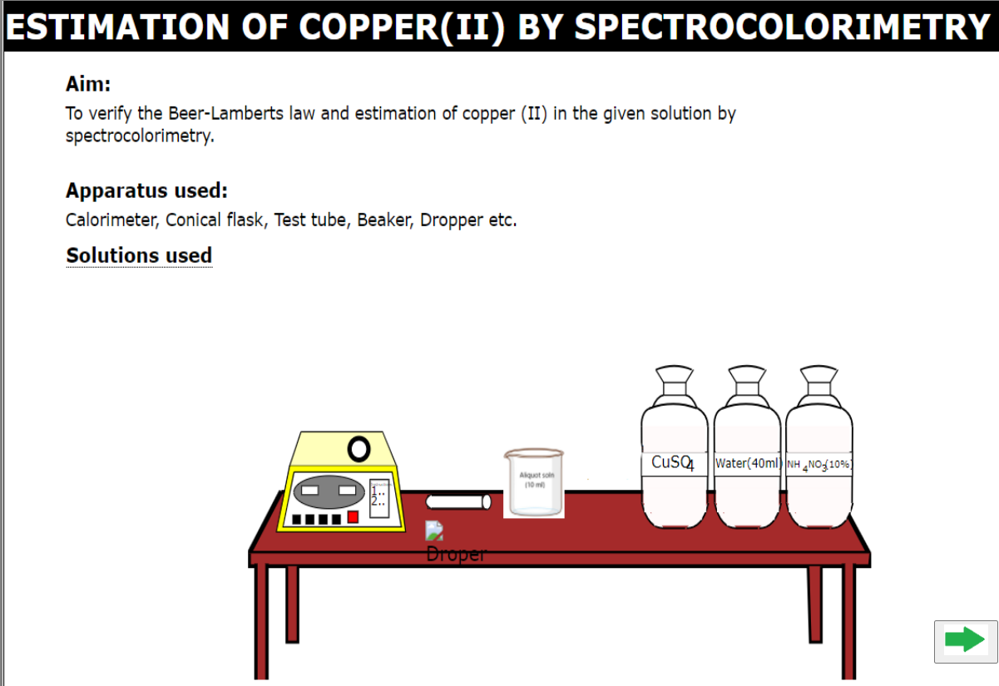
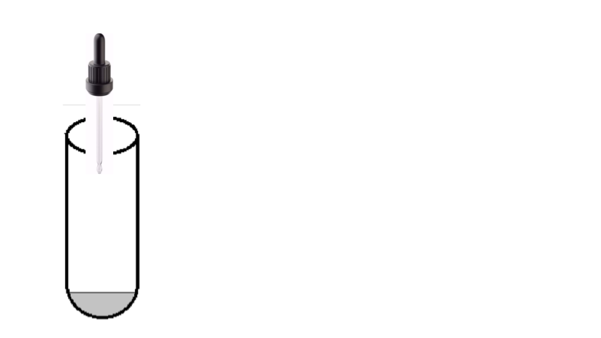
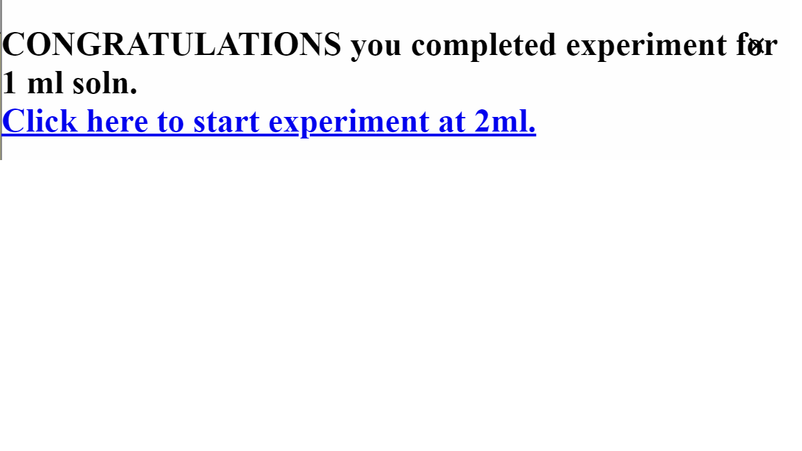
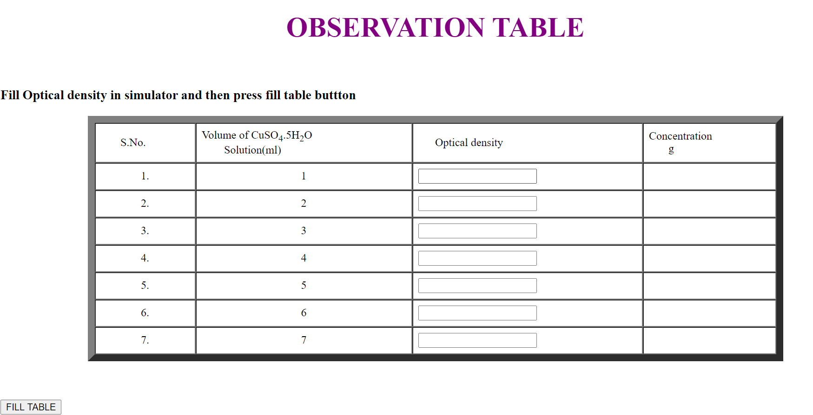
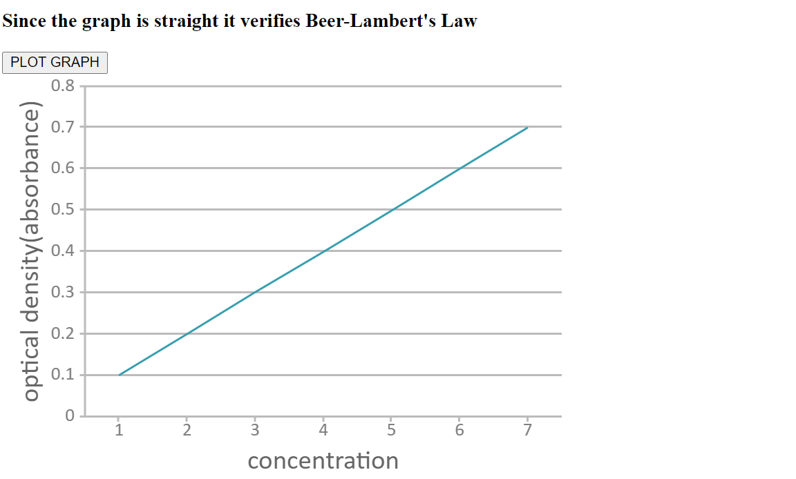

<b>Procedure</b>

Start the simulator by clicking on"click here to start the simulator".

click on add button to add CuSO4 and then click on pour. similarly,click button for water and H2SO4.after that click on next button.

Add few drops of solution which has been prepared and then add K4[Fe(CN)6] and NH4NO3, click on next button.

Turn on the apparatus

Set the wavelength.Place the test tube in the spectrocolorimeter.

Note the reading and perform that for seven times.

Fill the optical density in observation table in and then click on calculate to get the coppper weight.

Plot the graph by clicking on button.

